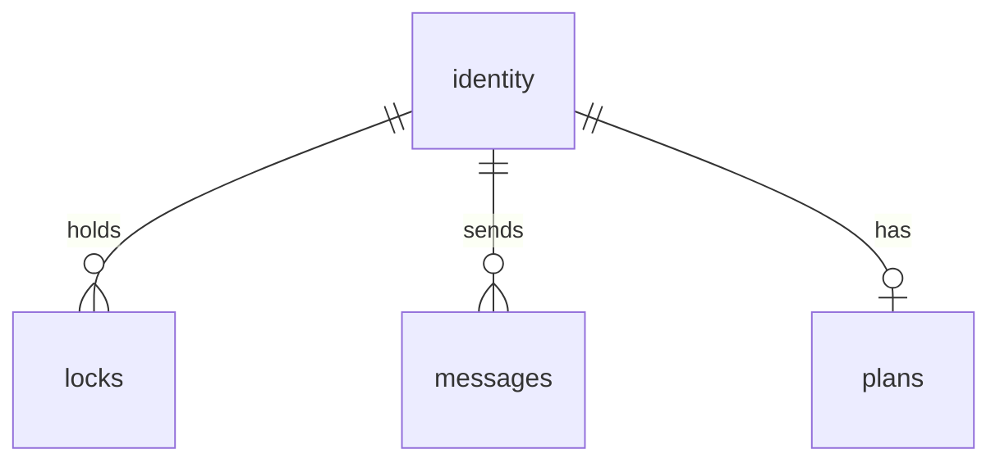

# Too Many Cooks - Multi-Agent Git Coordination MCP Server

## Overview

"Too Many Cooks" is an MCP server enabling multiple AI agents to safely edit a git repository simultaneously. It provides concurrency control through advisory file locking, agent identity verification, inter-agent messaging, and plan visibility.

**Location**: `examples/too_many_cooks/`

**Tech Stack**:
- Dart on Node.js via dart_node
- `better-sqlite3` via JS interop (new package: `packages/dart_node_better_sqlite3/`)
- MCP via `dart_node_mcp`
- All FP: typedef records, pure functions, `Result<T,E>` from nadz

---

## CRITICAL: Architecture Requirements

### ONE PROCESS, ONE DATABASE

**The MCP server MUST run as a single, long-lived process.** All clients (Claude Code, VSCode extension, other agents) connect to the SAME server instance.

```
┌─────────────────┐     ┌─────────────────┐     ┌─────────────────┐
│   Claude Code   │     │ VSCode Extension│     │  Other Agents   │
└────────┬────────┘     └────────┬────────┘     └────────┬────────┘
         │                       │                       │
         └───────────────────────┼───────────────────────┘
                                 │
                                 ▼
                    ┌────────────────────────┐
                    │   Too Many Cooks MCP   │  ← SINGLE PROCESS
                    │        Server          │
                    └───────────┬────────────┘
                                │
                                ▼
                    ┌────────────────────────┐
                    │   ~/.too_many_cooks/   │  ← SINGLE DATABASE
                    │        data.db         │
                    └────────────────────────┘
```

### Server Startup

**The MCP server must be started BEFORE any client connects.** Clients do NOT spawn the server.

```bash
# Start the server (run once, keeps running)
node examples/too_many_cooks/build/bin/server_node.js

# Or as a background daemon
nohup node examples/too_many_cooks/build/bin/server_node.js &
```

### Database Location

The database MUST be at a fixed, absolute path so all server instances share state:

```dart
// In config.dart
static String get dbPath {
  final home = Platform.environment['HOME'] ?? '/tmp';
  return '$home/.too_many_cooks/data.db';
}
```

**NOT** relative to cwd. **NOT** spawned per-client.

### Client Connection

Clients connect to the already-running server via:
- **stdio**: For Claude Code MCP integration
- **HTTP/SSE**: For VSCode extension (polls for changes)

The VSCode extension does NOT spawn its own server. It connects to the existing one or polls the shared database.

---

## Database Schema



- **identity**: agent_name (PK), agent_key, registered_at, last_active
- **locks**: file_path (PK), agent_name (FK), acquired_at, expires_at, reason, version
- **messages**: id (PK), from_agent (FK), to_agent, content, created_at, read_at
- **plans**: agent_name (PK/FK), goal, current_task, updated_at

---

## Configuration

```dart
typedef TooManyCooksConfig = ({
  String dbPath,              // SQLite database path
  int lockTimeoutMs,          // Default: 600000 (10 minutes)
  int maxMessageLength,       // Default: 200
  int maxPlanLength,          // Default: 100 per field
});

const defaultConfig = (
  dbPath: '.too_many_cooks.db',
  lockTimeoutMs: 600000,
  maxMessageLength: 200,
  maxPlanLength: 100,
);
```

---

## Core Types (typedef records)

```dart
// Identity
typedef AgentIdentity = ({
  String agentName,
  int registeredAt,
  int lastActive,
});

typedef AgentRegistration = ({
  String agentName,
  String agentKey,  // Only returned on registration
});

// Locks
typedef FileLock = ({
  String filePath,
  String agentName,
  int acquiredAt,
  int expiresAt,
  String? reason,
  int version,
});

typedef LockResult = ({
  bool acquired,
  FileLock? lock,
  String? error,  // e.g., "held by agent-X until ..."
});

// Messages
typedef Message = ({
  String id,
  String fromAgent,
  String toAgent,
  String content,
  int createdAt,
  int? readAt,
});

// Plans
typedef AgentPlan = ({
  String agentName,
  String goal,
  String currentTask,
  int updatedAt,
});
```

---

## Data Access Layer

Haskell-style typeclass pattern using typedef of function signatures:

```dart
/// Database operations - all return Result<T, DbError>
typedef TypedefName = ({

// [...]

});

//Create a type class for each of these

  // Identity
  Result<AgentRegistration, DbError> Function(String agentName) register,
  Result<AgentIdentity, DbError> Function(String agentName, String agentKey) authenticate,
  Result<List<AgentIdentity>, DbError> Function() listAgents,
  Result<void, DbError> Function(String agentName, String agentKey) heartbeat,

  // Locks
  Result<LockResult, DbError> Function(String filePath, String agentName, String agentKey, String? reason) acquireLock,
  Result<void, DbError> Function(String filePath, String agentName, String agentKey) releaseLock,
  Result<void, DbError> Function(String filePath, String agentName, String agentKey) forceReleaseLock, // For expired locks
  Result<FileLock?, DbError> Function(String filePath) queryLock,
  Result<List<FileLock>, DbError> Function() listLocks,
  Result<void, DbError> Function(String filePath, String agentName, String agentKey) renewLock,

  // Messages
  Result<void, DbError> Function(String fromAgent, String fromKey, String toAgent, String content) sendMessage,
  Result<List<Message>, DbError> Function(String agentName, String agentKey, {bool unreadOnly}) getMessages,
  Result<void, DbError> Function(String messageId, String agentName, String agentKey) markRead,

  // Plans
  Result<void, DbError> Function(String agentName, String agentKey, String goal, String currentTask) updatePlan,
  Result<AgentPlan?, DbError> Function(String agentName) getPlan,
  Result<List<AgentPlan>, DbError> Function() listPlans,

/// Error types
typedef DbError = ({String code, String message});

// Error codes
const errNotFound = 'NOT_FOUND';
const errUnauthorized = 'UNAUTHORIZED';
const errLockHeld = 'LOCK_HELD';
const errLockExpired = 'LOCK_EXPIRED';
const errValidation = 'VALIDATION';
const errDatabase = 'DATABASE';
```

---

## File Protection

No chmod. Only logical file locks - not physical.

---

## MCP Tools (5 total)

### `register`
Register a new agent. Returns key ONLY once - store it!
```
Input:  { name: string }
Output: { agent_name, agent_key }
```

### `lock`
Manage file locks. Action determines behavior.
```
Input: {
  action: "acquire" | "release" | "force_release" | "renew" | "query" | "list",
  agent_name?: string,
  agent_key?: string,
  file_path?: string,
  reason?: string
}
Output: { success, lock?, locks?, error? }
```
- `acquire`: requires agent_name, agent_key, file_path. Optional reason.
- `release`: requires agent_name, agent_key, file_path
- `force_release`: requires agent_name, agent_key, file_path. Only works if expired.
- `renew`: requires agent_name, agent_key, file_path
- `query`: requires file_path only (no auth)
- `list`: no params (no auth) - returns all locks

### `message`
Send/receive messages between agents.
```
Input: {
  action: "send" | "get" | "mark_read",
  agent_name: string,
  agent_key: string,
  to_agent?: string,
  content?: string,
  message_id?: string,
  unread_only?: bool
}
Output: { success, message_id?, messages? }
```
- `send`: requires to_agent, content (max 200 chars). Use '*' for broadcast.
- `get`: returns messages. unread_only defaults true.
- `mark_read`: requires message_id

### `plan`
Manage agent plans (what you're doing and why).
```
Input: {
  action: "update" | "get" | "list",
  agent_name?: string,
  agent_key?: string,
  goal?: string,
  current_task?: string
}
Output: { success, plan?, plans? }
```
- `update`: requires agent_name, agent_key, goal, current_task (max 100 chars each)
- `get`: requires agent_name only (no auth) - view any agent's plan
- `list`: no params - returns all plans

### `status`
Get system overview (agents, locks, plans).
```
Input: { }
Output: { agents: [...], locks: [...], plans: [...] }
```

---

## Packages to Create

### 1. `packages/dart_node_better_sqlite3/`

Dart bindings for better-sqlite3 npm package.

```dart
// Core types
typedef Database = ({
  Result<Statement, String> Function(String sql) prepare,
  Result<void, String> Function(String sql) exec,
  Result<void, String> Function() close,
  void Function(String pragma) pragma,
});

typedef Statement = ({
  Result<List<Map<String, Object?>>, String> Function([List<Object?>? params]) all,
  Result<Map<String, Object?>?, String> Function([List<Object?>? params]) get,
  Result<RunResult, String> Function([List<Object?>? params]) run,
});

typedef RunResult = ({int changes, int lastInsertRowid});

// Factory
Result<Database, String> openDatabase(String path);
```

Key implementation notes:
- Enable WAL mode: `db.pragma('journal_mode = WAL')`
- Set busy timeout: `db.pragma('busy_timeout = 5000')`
- Use IMMEDIATE transactions for writes

### 2. `examples/too_many_cooks/`

The MCP server implementation.

```
examples/too_many_cooks/
├── pubspec.yaml
├── analysis_options.yaml
├── lib/
│   ├── too_many_cooks.dart           # Main export
│   └── src/
│       ├── types.dart                # All typedef records
│       ├── config.dart               # Configuration
│       ├── db/
│       │   ├── schema.dart           # SQL schema constants
│       │   ├── db.dart               # TooManyCooksDb implementation
│       │   └── migrations.dart       # Schema versioning
│       ├── tools/
│       │   ├── identity_tools.dart   # register_agent, list_agents
│       │   ├── lock_tools.dart       # acquire_lock, release_lock, etc.
│       │   ├── message_tools.dart    # send_message, get_messages, etc.
│       │   └── plan_tools.dart       # update_plan, get_plan, list_plans
│       └── server.dart               # MCP server setup
├── bin/
│   └── server.dart                   # Entry point
└── test/
    ├── db_test.dart
    ├── lock_test.dart
    ├── message_test.dart
    ├── plan_test.dart
    └── integration_test.dart
```

---

## Key Implementation Details

### Authentication on Every Call

Every tool that takes `agent_name` + `agent_key` MUST:
1. Verify key matches the registered agent
2. Update `last_active` timestamp on success
3. Return `UNAUTHORIZED` error on mismatch

```dart
Result<void, DbError> authenticateAndUpdateActivity(
  Database db,
  String agentName,
  String agentKey,
) {
  final result = db.prepare('''
    UPDATE identity
    SET last_active = ?
    WHERE agent_name = ? AND agent_key = ?
  ''').run([DateTime.now().millisecondsSinceEpoch, agentName, agentKey]);

  return switch (result) {
    Success(:final value) when value.changes == 0 =>
      Error((code: errUnauthorized, message: 'Invalid agent credentials')),
    Success(_) => Success(null),
    Error(:final error) => Error((code: errDatabase, message: error)),
  };
}
```

### Lock Expiry Check

Any agent can force-release expired locks:

```dart
Result<void, DbError> forceReleaseLock(
  Database db,
  String filePath,
  String requestingAgent,
  String requestingKey,
) {
  // 1. Authenticate requesting agent (updates their last_active)
  // 2. Check if lock exists and is expired
  // 3. If expired: delete lock
  // 4. If not expired: return error with holder info
}
```

### Optimistic Concurrency for Locks

Use version column to prevent race conditions:

```dart
// Acquire: INSERT OR fail if exists
// Release: DELETE WHERE version = expected_version
// Renew: UPDATE ... SET version = version + 1 WHERE version = ?
```

---

## VSCode Extension

*[Placeholder - to be designed separately]*

---

## Usage Example

```dart
import 'package:too_many_cooks/too_many_cooks.dart';
import 'package:dart_node_mcp/dart_node_mcp.dart';

Future<void> main() async {
  final serverResult = createTooManyCooksServer(
    config: defaultConfig,
  );

  final server = switch (serverResult) {
    Success(:final value) => value,
    Error(:final error) => throw Exception(error),
  };

  final transportResult = createStdioServerTransport();
  final transport = switch (transportResult) {
    Success(:final value) => value,
    Error(:final error) => throw Exception(error),
  };

  await server.connect(transport);
}
```

---

# Review

**Database layer** ([db.dart](examples/too_many_cooks/lib/src/db/db.dart)): Full implementation with 4 tables, Result<T,E> error handling, proper schema with WAL mode.

**Server** ([server.dart](examples/too_many_cooks/lib/src/server.dart)): MCP server wired up with all tools and notification system.

**Types** ([types.dart](examples/too_many_cooks/lib/src/types.dart)): Clean typedef records for all data types.

### Do Tests Prove It Works?

**YES** - All 69 tests pass consistently.

**Test Coverage:**
- [db_test.dart](examples/too_many_cooks/test/db_test.dart): 32 unit tests covering identity, locks, messages, plans, lock expiration, and retry policy - **ALL PASSING**
- [integration_test.dart](examples/too_many_cooks/test/integration_test.dart): 37 end-to-end tests with 5 concurrent agents, race condition handling, error validation - **ALL PASSING**

The tests prove:
- Agent registration with unique key generation
- Lock acquisition/release/renewal
- Message sending and broadcast
- Plan updates and visibility
- Concurrent operations work correctly
- **Retry policy handles transient I/O errors with exponential backoff**

### Retry Policy

Database operations now include robust retry with exponential backoff for transient errors:

```dart
const defaultRetryPolicy = (
  maxAttempts: 3,
  baseDelayMs: 50,
  backoffMultiplier: 2.0,
);
```

Retryable errors: `disk I/O error`, `database is locked`, `SQLITE_BUSY`

### Summary

The implementation is **complete and tested**. All core features work: agent registration, file locking, messaging, plans, and status. The architecture follows all project rules (Result<T,E>, no exceptions, typedef records, async/await). Ready for production use with MCP clients.

**VSCode Extension**: Located at `examples/too_many_cooks_vscode_extension_dart/` - all 38 tests passing. Provides real-time visualization of agent status, locks, and messages.
