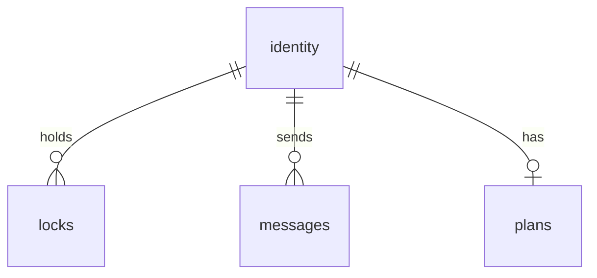

# Too Many Cooks - Multi-Agent Git Coordination MCP Server

## Overview

MCP server enabling multiple AI agents to safely edit a git repository simultaneously. Provides advisory file locking, agent identity, inter-agent messaging, and plan visibility.

**Location**: `examples/too_many_cooks/`

**Tech Stack**: Dart on Node.js, better-sqlite3 via JS interop, dart_node_mcp, FP (typedef records, Result<T,E>)

---

## Architecture

All clients access the **same SQLite database** in the workspace folder. VSCode extension accesses DB directly; MCP clients go through the server.

```
┌─────────────────┐                             ┌─────────────────┐
│   Claude Code   │                             │  Other Agents   │
│   (via MCP)     │                             │   (via MCP)     │
└────────┬────────┘                             └────────┬────────┘
         │                                               │
         ▼                                               ▼
┌─────────────────┐     ┌─────────────────┐     ┌─────────────────┐
│  MCP Server     │     │ VSCode Extension│     │  MCP Server     │
│  (per-client)   │     │  (direct DB)    │     │  (per-client)   │
└────────┬────────┘     └────────┬────────┘     └────────┬────────┘
         │                       │                       │
         └───────────────────────┼───────────────────────┘
                                 │
                                 ▼
                    ┌────────────────────────┐
                    │ ${workspaceFolder}/    │  ← SHARED DATABASE
                    │ .too_many_cooks/       │    (per-project)
                    │     data.db            │
                    └────────────────────────┘
```

The MCP and VSIX are completely decoupled other than the shared data access library.

**Database path**: `${workspaceFolder}/.too_many_cooks/data.db`

**MCP configuration**: Set `TMC_WORKSPACE` env var to workspace folder (falls back to cwd).

---

## Database Schema



| Table | Columns |
|-------|---------|
| identity | agent_name (PK), agent_key, registered_at, last_active |
| locks | file_path (PK), agent_name (FK), acquired_at, expires_at, reason, version |
| messages | id (PK), from_agent (FK), to_agent, content, created_at, read_at |
| plans | agent_name (PK/FK), goal, current_task, updated_at |

---

## MCP Tools (5 + admin + subscribe)

### `register`
Register agent. Returns key ONLY once - store it!
- Input: `{ name }`
- Output: `{ agent_name, agent_key }`

### `lock`
Manage file locks.
- Actions: `acquire`, `release`, `force_release`, `renew`, `query`, `list`
- `acquire/release/renew`: requires agent_name, agent_key, file_path
- `force_release`: only works on expired locks
- `query/list`: no auth required

### `message`
Inter-agent messaging.
- Actions: `send`, `get`, `mark_read`
- `send`: requires to_agent, content (max 200 chars). Use `*` for broadcast.
- `get`: returns messages (unread_only defaults true)

### `plan`
Agent plans (what you're doing and why).
- Actions: `update`, `get`, `list`
- `update`: requires agent_name, agent_key, goal, current_task (max 100 chars)
- `get/list`: no auth required

### `status`
System overview: agents, locks, plans, recent messages.

### `admin`
VSCode extension admin ops (no auth): `delete_lock`, `delete_agent`, `reset_key`

### `subscribe`
Real-time notifications for state changes.

---

## Package Structure

### `examples/too_many_cooks_data/` (Shared Data Layer)
Database access shared by MCP server and VSCode extension.
- `types.dart`: AgentIdentity, FileLock, Message, AgentPlan, DbError
- `config.dart`: TooManyCooksDataConfig, workspace path resolution
- `schema.dart`: SQL schema constants
- `db.dart`: TooManyCooksDb typeclass implementation

### `packages/dart_node_better_sqlite3/`
Dart bindings for better-sqlite3. WAL mode, busy timeout, Result<T,E> API.

### `examples/too_many_cooks/` (MCP Server)
MCP server using shared data package. Gets workspace from TMC_WORKSPACE env var.

### `examples/too_many_cooks_vscode_extension/` (VSCode Extension)
Direct DB access for real-time visualization. Tree views for agents, locks, plans.

---

## Key Behaviors

1. **Auth on every call**: Verify key, update last_active, return UNAUTHORIZED on mismatch
2. **Lock expiry**: Any agent can force_release expired locks
3. **Optimistic concurrency**: Version column on locks prevents races
4. **Retry policy**: 3 attempts, exponential backoff for transient SQLite errors
5. **Broadcast messages**: Use `*` as to_agent for broadcast

---

## Defaults

| Setting | Value |
|---------|-------|
| Lock timeout | 600000ms (10 min) |
| Max message length | 200 chars |
| Max plan field length | 100 chars |
| Retry attempts | 3 |
| Base retry delay | 50ms |

---

## Test Coverage

Tests are mostly end to end, meaning they test using UI/stdout interactions. There are some unit tests for the database access. Test by interacting with the DOM or with stdout for MCP, and verifying the contents of the DOM. Don't call code or even use commands unless it is necessary. Shoot towards BLACK BOX TESTING.

All tests in `examples/too_many_cooks_data/test/`:
- Registration, authentication, locks, messages, plans, admin operations
- Concurrent agents, race conditions, error validation
- Retry policy handles transient I/O errors
