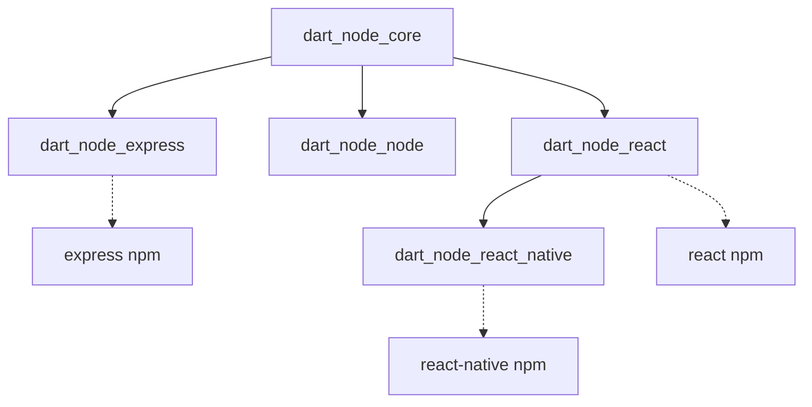

# dart_node_core

Core JS interop utilities for Dart-to-JavaScript compilation. This package provides the foundation for building React, React Native, and Express.js applications entirely in Dart.

Write your entire stack in Dart: React web apps, React Native mobile apps with Expo, and Node.js Express backends.

## Package Architecture

Part of the [dart_node](https://github.com/user/dart_node) package family.
