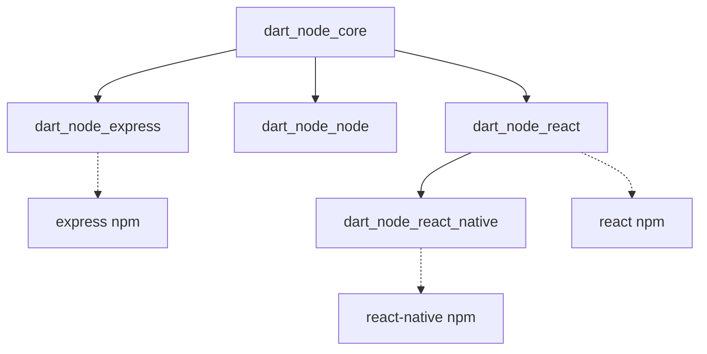

# dart_node_node

Node.js API bindings for Dart. Access Node.js core modules like fs, path, and http from Dart code with full type safety.

Write your entire stack in Dart: React web apps, React Native mobile apps with Expo, and Node.js Express backends.

## Package Architecture

Part of the [dart_node](https://github.com/user/dart_node) package family.
